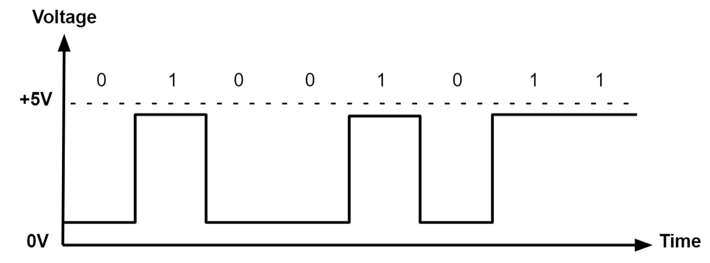

# 专有名词解释

**网络适配器**：俗称**网卡**，是将数字信号转成电信号的硬件设配，一般集成在机器内部，每个网络适配器需要有与之对应的驱动程序使用，否则无法使用。

**驱动**：一般指**驱动程序**，与硬件匹配的程序软件，是硬件的控制程序。如网卡需要安装网卡驱动，声卡需要安装声卡驱动。

**调制解调器**：主要负责**信号转换**。如光猫，是光信号与数字信号的互相转换；使用电话线进行拨号上网的电猫，是模拟信号与数字信号的相互转换。一般而言，调制解调器需要账号密码进行转换，拨号上网和光猫都一样，只不过现在的光猫已经将账号密码集成了，不需要手动设置。

**（电）信号**：信号是将数据从一个系统或网络传输到另一系统或网络的电磁或电流。在电子设备中，信号通常是随时间变化的电压，也是携带信息的电磁波，当然也可以是电流等其他形式。电子设备中使用的信号主要有两种类型：**模拟信号**和**数字信号**。

**模拟信号**：模拟信号会随时间变化，而且通常被限制在一个范围内（例如+ 12V 至-12V）。但在这个连续的范围内，它会有无限多个值。模拟信号使用介质的给定属性来传递信号信息，例如通过电线来传递电。在电信号中，用信号的不同电压、电流或频率来表达信息。模拟信号通常用于反应光线、声音、温度、位置、压力或其他物理现象的变化。 绘制电压与时间的关系图，我们会发现模拟信号会产生平滑而连续的曲线，不会产生任何离散变化。**电话线**就是使用模拟信号传输。

**数字信号**：数字信号则将数据表示为一连串离散的值。在给定时间内，数字信号只能从有限的一组可能值中选取一个值。采用数字信号，物理量表达的信息可能有很多种：

- 可变电流或电压
- 电磁场的相位或极化
- 声压
- 磁存储介质的磁化

数字信号用于所有的数字电子设备中，包括计算设备和数据传输设备。在电压与时间的关系图中，数字信号通常为 0 或 VCC（如 1.8V、3.3V 或 5V））两值之一。如今很多信号传输都是使用数字信号传输，如**网线**。

**光信号**：在光纤中传输的信号。

**DNS(Domain Name System)**：简而言之，就是**通过域名找 IP**。域名系统 (DNS) 是互联网的电话簿。人们通过例如 nytimes.com 或 espn.com 等域名在线访问信息。Web 浏览器通过 互联网协议 （IP） 地址进行交互。DNS 将域名转换为 IP 地址，以便浏览器能够加载互联网资源。连接到 Internet 的每个设备都有一个唯一 IP 地址，其他计算机可使用该 IP 地址查找此设备。DNS 服务器使人们无需存储例如 192.168.1.1（IPv4 中）等 IP 地址或更复杂的较新字母数字 IP 地址，例如 2400:cb00:2048:1::c629:d7a2（IPv6 中）。

_Reference_
[analog-vs-digital-signal](https://www.monolithicpower.cn/cn/analog-vs-digital-signal)
[what-is-dns](https://www.cloudflare-cn.com/learning/dns/what-is-dns/)
